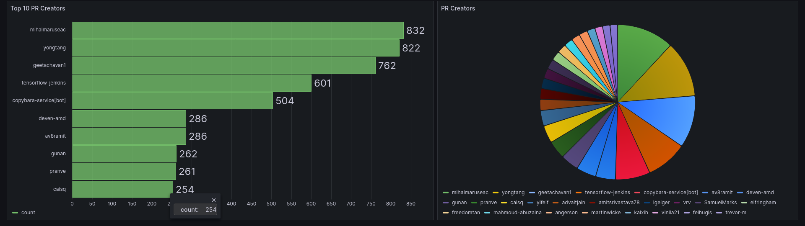

# Pull Request Analysis Tool

A pull requests analytics tool.

## Screenshots




## Techstack
* Python
* PostgreSQL
* Grafana
* Docker

## Setup and Installation
1. Generate a GitHub API Token.

2. Copy `example_config.json` to `config.json` and update values like GitHub API token, repository owners (for example `bovem`) and repository names (for example `pr-analysis-tool`)

## Deployment
1. Create necessary sub-directories in project's root directory.
```bash
mkdir -p ./app/raw_data/
mkdir -p ./app/cleaned_data/
mkdir -p ./app/metrics_data/
mkdir -p ./postgres-data/
```

2. Deploy containers
```bash
docker compose up -d
```

3. Visit Grafana dashbaord at [localhost:3111](http://localhost:3111)

4. Configure PostgreSQL [Data Connection](http://localhost:3111/connections/datasources) with the values provided in [compose.yaml](./compose.yaml) file.

5. Change the value of `PAT_CONFIG_FILE` environment variable in [compose.yaml](./compose.yaml).

6. Open **Pull Request and PipelineRun Statistics Dashboard**.

7. Fetch Pull Request data from GitHub API

## Initial Data Fetch
```bash
docker exec -it pr-analysis-tool-backend-1 python3 initial_data_fetch.py
````

## Updating Data
```bash
docker exec -it pr-analysis-tool-backend-1 python3 update_data.py
```
